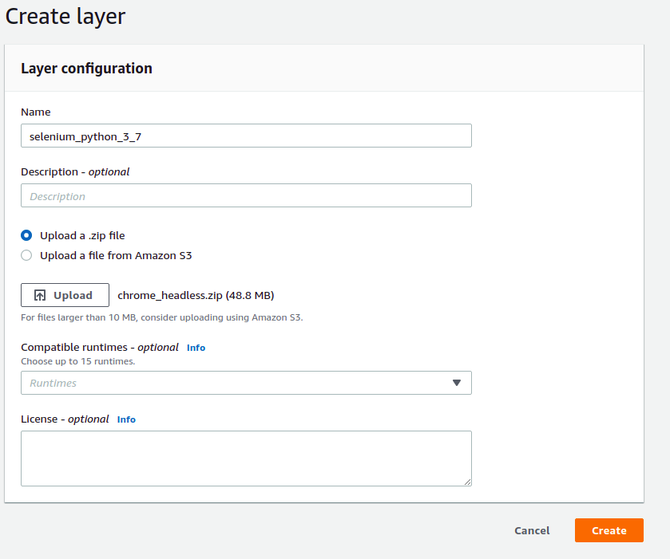

# weekly-fei-bot

# Introduction
This objective of this project is to automate the daily feedback of the [FEI](https://portal.fei.edu.br/) college.

# How to run on [AWS](https://aws.amazon.com/)
In order to run the bot on aws follow the next steps:

1. Configuring credentials
  - Insert your username and password of FEI in the file **bot.py**
  

2. Configuring Lambda
   - Go to functions in Lambda page
   - Click in **create function button** on top right
     
   - Click in **Layers**, click in **Create a layer**
   - Insert a name and upload the file **chrome_headless.zip**, this file is in the repository that you cloned
     
   - Add the layer
     

   - Copy the code of [bot.py](https://github.com/henriquevital00/weekly-fei-bot/blob/main/bot.py) and paste in code source
     

   - Go to configuration in General Configuration change the **Timeout to 3min** and change the **memory to 1000**

3. Configuring trigger
   - Go to Cloud Watch, click in Events and Rules
   - Create a rule
     
   - Change the con expression to match your study time, **be carefull the time used is in GMT**, to convert to our local our in Brazil, **add 3 hours to the hour that you want**
   - for each different time, create a new rule and link to the lambda function in targets